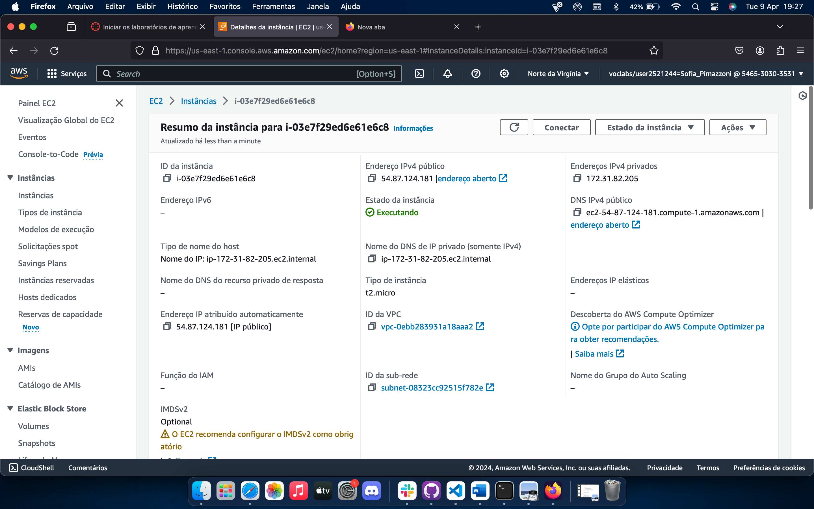

# PONDERADA S10: Automate Terraform with GitHub Actions

## Introdução

Este documento aborda a relação entre o GitHub Actions e o Terraform para a orquestração e administração da infraestrutura na Amazon Web Services (AWS). A convergência dessas plataformas simplifica a adoção de métodos de Infraestrutura como Código, uma abordagem fundamental para automatizar procedimentos em ambientes de computação em nuvem.

## Tecnologias utilizadas

**GitHub Actions:** o GitHub Actions é uma ferramenta que ajuda os desenvolvedores a automatizar tarefas dentro do GitHub. Com ele, você pode criar fluxos de trabalho (actions) que são acionados por eventos, como commits ou pull requests em um repositório. Esses fluxos de trabalho podem ser usados para construir, testar, implantar e automatizar outras tarefas relacionadas ao desenvolvimento de software.

**Terraform:** o Terraform é uma ferramenta usada para gerenciar infraestrutura como código. Isso significa que você pode descrever sua infraestrutura de computação (como servidores, redes e recursos em nuvem) em arquivos de configuração. Em seguida, o Terraform pode ler esses arquivos e provisionar automaticamente a infraestrutura necessária, garantindo consistência e facilitando a replicação em diferentes ambientes, como desenvolvimento, teste e produção.

## Conceitos aprendidos

Por meio desse tutorial, eu aprendi que é muito importante pensar na automatização da pipeline de testes e implantação de código em cloud computing. Além disso, eu pude aprender a como fazer isso utilizando o Terraform, que é uma ferrramenta muito conhecida.

## Prints do exercício

Como é possível perceber nessa imagem, a pipeline automatizada foi executada pelo github actions com sucesso.

 

Após sua execução, é possível ver que uma instância foi criada na AWS, como pode ser visto a seguir:

 

Por último, ao entrar no link da instância, uma página web se abre com a mensagem local-host, o que garante que o processo de realizar uma pipeline automatizada foi executado com sucesso.

## Conslusão 

A relação entre o Github Actions e o Terraform permite uma gestão de qualidade da infraestrutura em cloud.

This repo is a companion repo to the [Automate Terraform with GitHub Actions tutorial](https://developer.hashicorp.com/terraform/tutorials/automation/github-actions).
